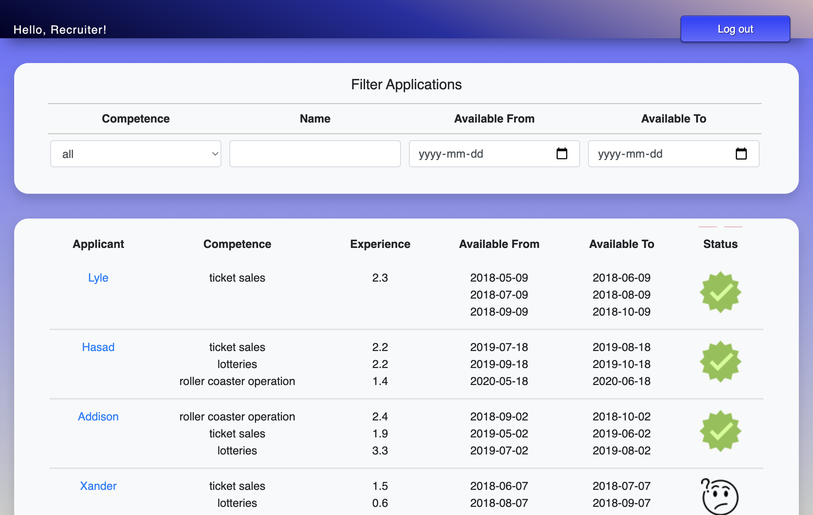

# Recruitment Application Recruiter Front
This is a project for the course IV1201, Design of Global Applications, at KTH, Sweden.
The project is about creating a recruitment platform where applicants can apply for the job and recruiters can read and approve the applications.

This repository concers the recruiter front end. 
- The applicant front end can be found [here](https://gitlab.com/iv1201group15/recruitment-application-applicant-front)!
- The back end can be found [here](https://gitlab.com/iv1201group15/recruitment-application)!

## Getting started
This project is built with Maven using Spring Boot, Thymeleaf, PostgreSQL. Run these commands to get started:

```
./mvnw clean install
./mvnw spring-boot:run
```

## Visuals
Recruiter Home Page


## Configuration
This project makes use of some known environment variables that are used in the production to facilitate development. These can be found in the file [application.properties](src/main/resources/application.properties) and needs to be used differently depending on using local or cloud back end server. 

When developing and testing the application, there is a variable that needs to be set differently depending on wheter the application should run locally or on heroku. This can be found in [table.js](src/main/resources/static/js/table.js) 

#### For local front end server
```
const host = "http://localhost:8000"
```
#### For cloud front end server
```
const host = "https://recruiter-app-applicant.herokuapp.com"
```

#### For local back end server
These variables needs to be set when using a local back end server.

In [application.properties](src/main/resources/application.properties)
```
server.port=8000
backend.dev-local=http://localhost:8080
back-end.dev-local.api.application.url=http://localhost:8080/api/users/recruiter/applications/%s/
back-end.dev-local.api.login.url=http://localhost:8080/api/users/recruiter/authenticate
back-end.dev-local.api.filter.url=http://localhost:8080/api/users/recruiter/filter
back-end.dev-local.api.update-application.url=http://localhost:8080/api/users/recruiter/applications/%s/state
back-end.dev-local.api.competence.url=http://localhost:8080/api/competences/
back-end.dev-local.api.application-by-competence.url=http://localhost:8080/api/users/recruiter/applications/competences/page?size=%s&page=%s
```

In [APIService.js](src/main/java/com/iv1201/recruiterwebapp/recruiterwebapp/service/APIService.java)
```
@Value("${back-end.dev-local.api.login.url}")
private String loginURL;
@Value("${back-end.dev-local.api.filter.url}")
private String filterURL;
@Value("${back-end.dev-local.api.application.url}")
private String applicationUrl;
@Value("${back-end.dev-local.api.competence.url}")
private String competenceURL;
@Value("${back-end.dev-local.api.update-application.url}")
private String updateApplicationURL;
@Value("${back-end.dev-local.api.application-by-competence.url}")
private String findApplicationByCompetence;
@Value("${back-end.dev-local}")
private String host;
```

#### For heroku cloud back end server
These variables needs to be set when using the heroku cloud back end server.

In [application.properties](src/main/resources/application.properties)
```
backend.dev-heroku=https://kth-iv1201.herokuapp.com
back-end.dev-heroku.api.application.url=https://kth-iv1201.herokuapp.com/api/users/recruiter/applications/%s/
back-end.dev-heroku.api.login.url=https://kth-iv1201.herokuapp.com/api/users/recruiter/authenticate
back-end.dev-heroku.api.filter.url=https://kth-iv1201.herokuapp.com/api/users/recruiter/filter
back-end.dev-heroku.api.update-application.url=https://kth-iv1201.herokuapp.com/api/users/recruiter/applications/%s/state
back-end.dev-heroku.api.competence.url=https://kth-iv1201.herokuapp.com/api/competences/
back-end.dev-heroku.api.application-by-competence.url=https://kth-iv1201.herokuapp.com/api/users/recruiter/applications/competences/page?size=%s&page=%s
```

In [APIService.js](src/main/java/com/iv1201/recruiterwebapp/recruiterwebapp/service/APIService.java)
```
@Value("${back-end.dev-heroku.api.login.url}")
private String loginURL;
@Value("${back-end.dev-heroku.api.filter.url}")
private String filterURL;
@Value("${back-end.dev-heroku.api.application.url}")
private String applicationUrl;
@Value("${back-end.dev-heroku.api.competence.url}")
private String competenceURL;
@Value("${back-end.dev-heroku.api.update-application.url}")
private String updateApplicationURL;
@Value("${back-end.dev-heroku.api.application-by-competence.url}")
private String findApplicationByCompetence;
@Value("${backend.dev-heroku}")
private String host;
```

## Developing
To start developing, clone the repository with these commands
```
git clone git@gitlab.com:iv1201group15/recruitment-application-recruiter-front.git
cd recruitment-application-recruiter-front
./mvnw clean install
```
Don't forget to use the correct enviroment variables described in [Configuration](#configuration)

When developing, one can add [Gitlab issues](https://gitlab.com/iv1201group15/recruitment-application-recruiter-front/-/issues?sort=created_date&state=opened) to the [Development Board](https://gitlab.com/iv1201group15/recruitment-application-recruiter-front/-/boards/3934165) to faciliate development and keep a good structure of what needs to be done. The issue number can later be used in the commit message to organize all commits, see [git conventions](https://gitlab.com/iv1201group15/recruitment-application-recruiter-front/-/wikis/4-Git-commit-convention)

## Logging
This project uses Spring Boot logback with Lombok, a dependency required in the [pom.xml](.pom.xml) file. The logging is stored in files in the [logs folder](/logs) and also displayed on the console, which is the logging applied to the deployed application. <br>
The logging settings are found both in the [logback.xml](https://gitlab.com/iv1201group15/recruitment-application-recruiter-front/-/blob/main/src/main/resources/logback.xml) file, for general log format and levels, and the [LoggingController](https://gitlab.com/iv1201group15/recruitment-application-recruiter-front/-/blob/main/src/main/java/com/iv1201/recruiterwebapp/recruiterwebapp/controller/LoggingController.java) for the filter settings of the HTTP requests to log. 
```
Root Level Logging:
- Error
- Fatal
- Warn

Application Logging:
- Error
- Info
- Trace

Request Logging via Filter:
- Debug
```


## Test and Deploy
This project uses the built-in continuous integration in GitLab. The [.gitlab-ci.yml](.gitlab-ci.yml) file will run for each push to any branch, but only deploy the main branch.

#### Future testing
Unit tests is not yet implemented in this project. If future testers decides to create such tests and use, for example, [Maven Surefire Plugin](https://maven.apache.org/surefire/maven-surefire-plugin/) the result of each test will be displayed in the build job log for that particular pipeline.

#### Static analysing
The project uses [Maven PMD Plugin](https://maven.apache.org/plugins/maven-pmd-plugin/) for static analysing which is added in the [pom.xml](pom.xml). In the [excludeFromPmdCheck.properties](excludeFromPmdCheck.properties) can one add rules to be excluded in the analysis.

#### Deployment
The environment variables below are added in the GitLab repository to be able to test and deploy with CI/CD pipelines. The [.gitlab-ci.yml](.gitlab-ci.yml) script will first install ruby to be able to later use dpl to deploy the main branch to heroku. 

Read more about the .gitlab-ci.yml file [here](https://docs.gitlab.com/ee/ci/yaml/gitlab_ci_yaml.html) and about deploying with dpl [here](https://docs.gitlab.com/ee/ci/examples/deployment/)
```
$SPRING_DATASOURCE_DB: The database name
$SPRING_DATASOURCE_USER: The database username
$SPRING_DATASOURCE_PASSWORD: The database password
$HEROKU_APP: The heroku app link for deployment
$HEROKU_API_KEY: The personal heroku API key for the owner of the heroku app
```
The deployed application can be found here: [https://recruiter-app-recruiter.herokuapp.com](https://recruiter-app-recruiter.herokuapp.com)

##### Important
Don't forget to use the heroku host variable in [table.js](src/main/resources/static/js/table.js)  when deploying, or else the application will not be able to fetch an application list with Ajax correctly. See [Configuration for cloud front end server](#for-cloud-front-end-server)

## Installation
Spring Boot will automatically install and build the neccessary dependencies with Maven.

## Authors and acknowledgment
 - [Vera Lindström](https://github.com/veralindstrom)
 - [Estelle Hue](https://github.com/estellehue)
 - [Samuel Ferrara](https://github.com/ferrara-dev)

## Project status
Possible future improvements: 
 - Unit Testing
 - Integration Testing
 - Acceptance Testing
 - Internationalization 
 - Localization
 - Filter name and availability on all applications not only those visible on current page

## Links
Project Homepage: [https://recruiter-app-recruiter.herokuapp.com](https://recruiter-app-recruiter.herokuapp.com)
<br>
Wiki Page: [https://gitlab.com/iv1201group15/recruitment-application-recruiter-front/-/wikis/home](https://gitlab.com/iv1201group15/recruitment-application-recruiter-front/-/wikis/home)

